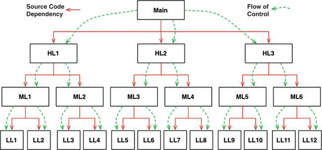
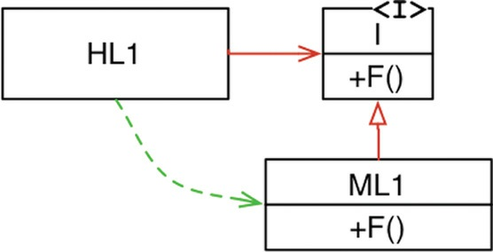
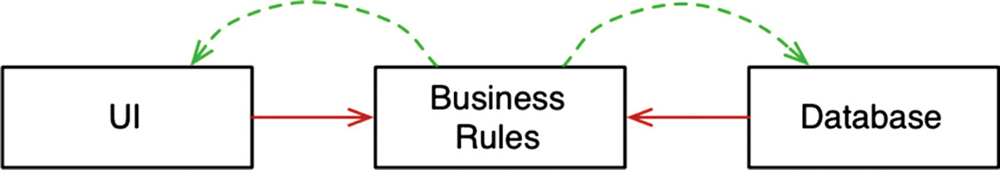

# OBJECT-ORIENTED PROGRAMMING
As we will see, the basis of a good architecture is the understanding and application of the principles
of object-oriented design (OO). But just what is OO?

OO is the proper admixture of these three things encapsulation, inheritance,
and polymorphism.

## Encapsulation

OO languages provide easy
and effective encapsulation of data and function. As a result, a line can be drawn around a cohesive
set of data and functions. Outside of that line, the data is hidden and only some of the functions are
known.

Let's have a look at a comparison between C and C++
### C
Point.h
```
struct Point;
struct Point* makePoint(double x, double y);
double distance (struct Point *p1, struct Point *p2);
```
Point.c
```
#include "point.h"
#include <stdlib.h>
#include <math.h>
struct Point {
double x,y;
};
struct Point* makepoint(double x, double y) {
struct Point* p = malloc(sizeof(struct Point));
p->x = x;
p->y = y;
return p;
}
double distance(struct Point* p1, struct Point* p2) {
double dx = p1->x - p2->x;
double dy = p1->y - p2->y;
return sqrt(dx*dx+dy*dy);
}
```
The users of point.h have no access to members of point struct.
They can call the functions but they have absolutely no knowledge of
the implementation of either the Point data structure or the functions.

This is perfect encapsulation—in a non-OO language.

But then came OO in the form of C++—and the perfect encapsulation of C was broken.

### C++
Point.h
```
class Point {
public:
Point(double x, double y);
double distance(const Point& p) const;
private:
double x;
double y;
};
```
Point.cpp
```
#include "point.h"
#include <math.h>
Point::Point(double x, double y)
: x(x), y(y)
{}
double Point::distance(const Point& p) const {
double dx = x-p.x;
double dy = y-p.y;
return sqrt(dx*dx + dy*dy);
}
```
Clients of the header file point.h know about the member variables x and y ! The compiler will
prevent access to them, but the client still knows they exist.

For example, if those member names are
changed, the point.cpp file must be recompiled! Encapsulation has been broken.

It is difficult to accept that OO depends on strong encapsulation. Indeed, many OO
languages have little or no enforced encapsulation.

## INHERITANCE

Inheritance is simply the redeclaration of a group of variables and functions within an
enclosing scope.

This is something C programmers 3 were able to do manually long before there was
an OO language.

namedPoint.h
```
struct NamedPoint;
struct NamedPoint* makeNamedPoint(double x, double y, char* name);
void setName(struct NamedPoint* np, char* name);
char* getName(struct NamedPoint* np);
```

namedPoint.c
```
#include "namedPoint.h"
#include <stdlib.h>
struct NamedPoint {
double x,y;
char* name;
};
struct NamedPoint* makeNamedPoint(double x, double y, char* name) {
struct NamedPoint* p = malloc(sizeof(struct NamedPoint));
p->x = x;
p->y = y;
p->name = name;
return p;
}
void setName(struct NamedPoint* np, char* name) {
np->name = name;
}
char* getName(struct NamedPoint* np) {
return np->name;
}
```

main.c
```
#include "point.h"
#include "namedPoint.h"
#include <stdio.h>
int main(int ac, char** av) {
struct NamedPoint* origin = makeNamedPoint(0.0, 0.0, "origin");
struct NamedPoint* upperRight = makeNamedPoint (1.0, 1.0, "upperRight");
printf("distance=%f\n",
distance(
(struct Point*) origin,
(struct Point*) upperRight));
}
```

If you look carefully at the main program, you’ll see that the NamedPoint data structure acts as though
it is a derivative of the Point data structure.

This kind of trickery was a common practice 4 of programmers prior to the advent of OO. In fact, such
trickery is how C++ implements single inheritance.

It’s fair to say that while OO languages did not give us something completely brand new, it did make
the masquerading of data structures significantly more convenient.

To recap: We can award no point to OO for encapsulation, and perhaps a half-point for inheritance.
So far, that’s not such a great score.

## POLYMORPHISM

The bottom line is that polymorphism is an application of pointers to functions. Programmers have
been using pointers to functions to achieve polymorphic behavior since Von Neumann architectures
were first implemented in the late 1940s. In other words, OO has provided nothing new.

Ah, but that’s not quite correct. OO languages may not have given us polymorphism, but they have
made it much safer and much more convenient.

### THE POWER OF POLYMORPHISM

What’s so great about polymorphism? To better appreciate its charms, let’s reconsider the example
copy program. What happens to that program if a new IO device is created? Suppose we want to use
the copy program to copy data from a handwriting recognition device to a speech synthesizer device:
How do we need to change the copy program to get it to work with those new devices?

We don’t need any changes at all! Indeed, we don’t even need to recompile the copy program. Why?
Because the source code of the copy program does not depend on the source code of the IO drivers.
As long as those IO drivers implement the five standard functions defined by FILE , the copy program
will be happy to use them.

In short, the IO devices have become plugins to the copy program.

OO allows the plugin architecture to be used anywhere, for anything.

### DEPENDENCY INVERSION

Imagine what software was like before a safe and convenient mechanism for polymorphism was
available. In the typical calling tree, main functions called high-level functions, which called mid-
level functions, which called low-level functions. In that calling tree, however, source code
dependencies inexorably followed the flow of control (fig1).




For main to call one of the high-level functions, it had to mention the name of the module that
contained that function In C, this was a #include.Indeed, every caller was forced to mention the name of the module that contained
the callee.

This requirement presented the software architect with few, if any, options. The flow of control was
dictated by the behavior of the system, and the source code dependencies were dictated by that flow
of control.

When polymorphism is brought into play, however, something very different can happen.



In Figure 2, module HL1 calls the F() function in module ML1 . The fact that it calls this function
through an interface is a source code contrivance (invention). At runtime, the interface doesn’t exist. HL1 simply
calls F() within ML1.

Note, however, that the source code dependency (the inheritance relationship) between ML1 and the
interface I points in the opposite direction compared to the flow of control. This is called
dependency inversion, and its implications for the software architect are profound.

The fact that OO languages provide safe and convenient polymorphism means that any source code
dependency, no matter where it is, can be inverted.

With this approach, software architects working in systems written in OO languages have absolute
control over the direction of all source code dependencies in the system. They are not constrained to
align those dependencies with the flow of control. No matter which module does the calling and
which module is called, the software architect can point the source code dependency in either
direction.

That is power! That is the power that OO provides. That’s what OO is really all about—at least from
the architect’s point of view.


What can you do with that power? As an example, you can rearrange the source code dependencies of
your system so that the database and the user interface (UI) depend on the business rules (Figure 3),
rather than the other way around.



This means that the UI and the database can be plugins to the business rules. It means that the source
code of the business rules never mentions the UI or the database.

As a consequence, the business rules, the UI, and the database can be compiled into three separate
components or deployment units that have the same dependencies
as the source code. The component containing the business rules will not depend on the components
containing the UI and database.

In turn, the business rules can be deployed independently of the UI and the database. Changes to the
UI or the database need not have any effect on the business rules. Those components can be deployed
separately and independently.

In short, when the source code in a component changes, only that component needs to be redeployed.
This is **independent deployability**.

If the modules in your system can be deployed independently, then they can be developed
independently by different teams. That’s **independent developability**.

## Conclusion

OO is the ability, through the use of polymorphism, to gain absolute
control over every source code dependency in the system. It allows the architect to create a plugin
architecture, in which modules that contain high-level policies are independent of modules that
contain low-level details.