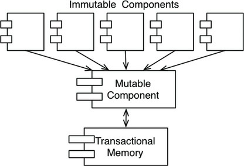

# FUNCTIONAL PROGRAMMING

In many ways, the concepts of functional programming predate programming itself. This paradigm is
strongly based on the l-calculus invented by Alonzo Church in the 1930s.

Variables in functional languages do not vary.

## IMMUTABILITY AND ARCHITECTURE

Why is this point important as an architectural consideration? Why would an architect be concerned
with the mutability of variables? The answer is absurdly simple: All race conditions, deadlock
conditions, and concurrent update problems are due to mutable variables. You cannot have a race
condition or a concurrent update problem if no variable is ever updated. You cannot have deadlocks
without mutable locks.

In other words, all the problems that we face in concurrent applications—all the problems we face in
applications that require multiple threads, and multiple processors—cannot happen if there are no
mutable variables.

The question
you must be asking yourself, then, is whether immutability is practicable.

The answer to that question is affirmative, if you have infinite storage and infinite processor speed.
Lacking those infinite resources, the answer is a bit more nuanced. Yes, immutability can be
practicable, if certain compromises are made.

Let’s look at some of those compromises.

## SEGREGATION OF MUTABILITY
One of the most common compromises in regard to immutability is to segregate the application, or the
services within the application, into mutable and immutable components. The immutable components
perform their tasks in a purely functional way, without using any mutable variables. The immutable
components communicate with one or more other components that are not purely functional, and allow
for the state of variables to be mutated

Since mutating state exposes those components to all the problems of concurrency, it is commonpractice to use some kind of transactional memory to protect the mutable variables from concurrent
updates and race conditions.

## EVENT SOURCING

Event sourcing is a strategy wherein we store the
transactions, but not the state. When state is required, we simply apply all the transactions from the
beginning of time.

Of course, we can take shortcuts. For example, we can compute and save the state every midnight.
Then, when the state information is required, we need compute only the transactions since midnight.

Nothing ever gets deleted or updated from such a data store. As a consequence, our
applications are not CRUD; they are just CR. Also, because neither updates nor deletions occur in the
data store, there cannot be any **concurrent update issues**.

If we have enough storage and enough processor power, we can make our applications entirely
immutable—and, therefore, entirely functional.

If this still sounds absurd, it might help if you remembered that this is precisely the way your source
code control system works.

As a simple example, imagine a banking application that maintains the account balances of itscustomers. It mutates those balances when deposit and withdrawal transactions are executed.
Now imagine that instead of storing the account balances, we store only the transactions. Whenever
anyone wants to know the balance of an account, we simply add up all the transactions for that
account, from the beginning of time. This scheme requires no mutable variables.

## Conclusion

To summarize:

• Structured programming is discipline imposed upon direct transfer of control.

• Object-oriented programming is discipline imposed upon indirect transfer of control.

• Functional programming is discipline imposed upon variable assignment.

Each of these three paradigms has taken something away from us. Each restricts some aspect of the
way we write code. None of them has added to our power or our capabilities.

What we have learned over the last half-century is **what not to do**.

With that realization, we have to face an unwelcome fact: Software is not a rapidly advancing
technology. The rules of software are the same today as they were in 1946, when Alan Turing wrote
the very first code that would execute in an electronic computer. The tools have changed, and the
hardware has changed, but the essence of software remains the same.

Software—the stuff of computer programs—is composed of sequence, selection, iteration, and
indirection. Nothing more. Nothing less