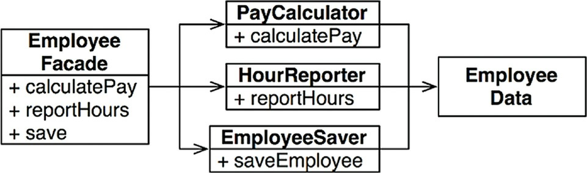

# SRP: THE SINGLE RESPONSIBILITY PRINCIPLE

Historically, the SRP has been described this way:

`A module should have one, and only one, reason to change.`
Software systems are changed to satisfy users and stakeholders; those users and stakeholders are the
“reason to change” that the principle is talking about. Indeed, we can rephrase the principle to say
this:

`A module should be responsible to one, and only one, user or stakeholder.`

Unfortunately, the words “user” and “stakeholder” aren’t really the right words to use here. There
will likely be more than one user or stakeholder who wants the system changed in the same way.
Instead, we’re really referring to a group—one or more people who require that change. We’ll referto that group as an actor.
Thus the final version of the SRP is:

`A module should be responsible to one, and only one, actor.`

Now, what do we mean by the word “module”? The simplest definition is just a source file. Most of
the time that definition works fine. Some languages and development environments, though, don’t use
source files to contain their code. In those cases a module is just a cohesive set of functions and data
structures.

Perhaps the best way to understand this principle is by looking at the symptoms of **violating** it.

## SYMPTOM 1: ACCIDENTAL DUPLICATION

Let's have a look on this Employee Class.

It has three methods:

calculatePay() , reportHours() , and save()

This class violates the SRP because those three methods are responsible to three very different
actors.

• The calculatePay() method is specified by the accounting department, which reports to the CFO.

• The reportHours() method is specified and used by the human resources department, which
reports to the COO.

• The save() method is specified by the database administrators (DBAs), who report to the CTO.

This coupling can cause the actions of the CFO’s team to
affect something that the COO’s team depends on.

For example, suppose that the calculatePay() function and the reportHours() function share a
common algorithm for calculating non-overtime hours. Suppose also that the developers, who are
careful not to duplicate code, put that algorithm into a function named regularHours()

Now suppose that the CFO’s team decides that the way non-overtime hours are calculated needs to be
tweaked. In contrast, the COO’s team in HR does not want that particular tweak because they use non-
overtime hours for a different purpose.

A developer is tasked to make the change, and sees the convenient regularHours() function called
by the calculatePay() method. Unfortunately, that developer does not notice that the function is also
called by the reportHours() function.

We’ve all seen things like this happen. These problems occur because we put code that different
actors depend on into close proximity. The SRP says to separate the code that different actors
depend on.

## SYMPTOM 2: MERGES

It’s not hard to imagine that merges will be common in source files that contain many differentmethods. This situation is especially likely if those methods are responsible to different actors.

For example, suppose that the CTO’s team of DBAs decides that there should be a simple schema
change to the Employee table of the database. Suppose also that the COO’s team of HR clerks
decides that they need a change in the format of the hours report.

Two different developers, possibly from two different teams, check out the Employee class and begin
to make changes. Unfortunately their changes collide. The result is a merge.

I probably don’t need to tell you that merges are risky affairs. Our tools are pretty good nowadays,
but no tool can deal with every merge case. In the end, there is always risk.

In our example, the merge puts both the CTO and the COO at risk. It’s not inconceivable that the CFO
could be affected as well.

There are many other symptoms that we could investigate, but they all involve multiple people
changing the same source file for different reasons.

Once again, the way to avoid this problem is to separate code that supports different actors.

## SOLUTIONS

There are many different solutions to this problem. Each moves the functions into different classes.

Perhaps the most obvious way to solve the problem is to separate the data from the functions. The
three classes share access to EmployeeData , which is a simple data structure with no methods.
Thus any accidental duplication is avoided.

The downside of this solution is that the developers now have three classes that they have to
instantiate and track. A common solution to this dilemma is to use the Facade pattern.

The EmployeeFacade contains very little code. It is responsible for instantiating and delegating to the
classes with the functions.

Some developers prefer to keep the most important business rules closer to the data. It can be done this way.

## Facade Design Pattern

To make a complex subsystem easier to use, a simple interface should be provided for a set of interfaces in the subsystem.

For each homogenous or relevant functions we define a class like the example above let's say we have 
1. CalculatePayer
2. EmployeeSaver
3. HourReporter

All these 3 classes need to deal with EmployeeData.

So we define a class Employee and this class has an instance of each of the above defined classes.

Considering the way we get the data, as it was shown there are 2 ways.

1. Inside EmployeeClass creata an access to the data and make it private.
2. Make each of the 3 classes grab the data by itself.

