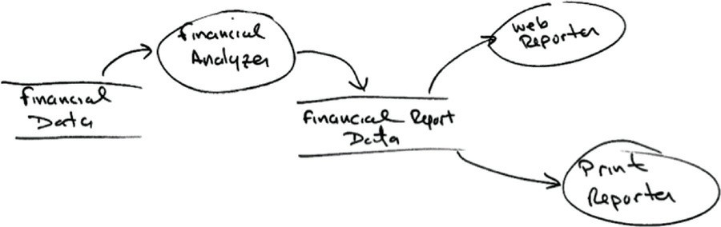
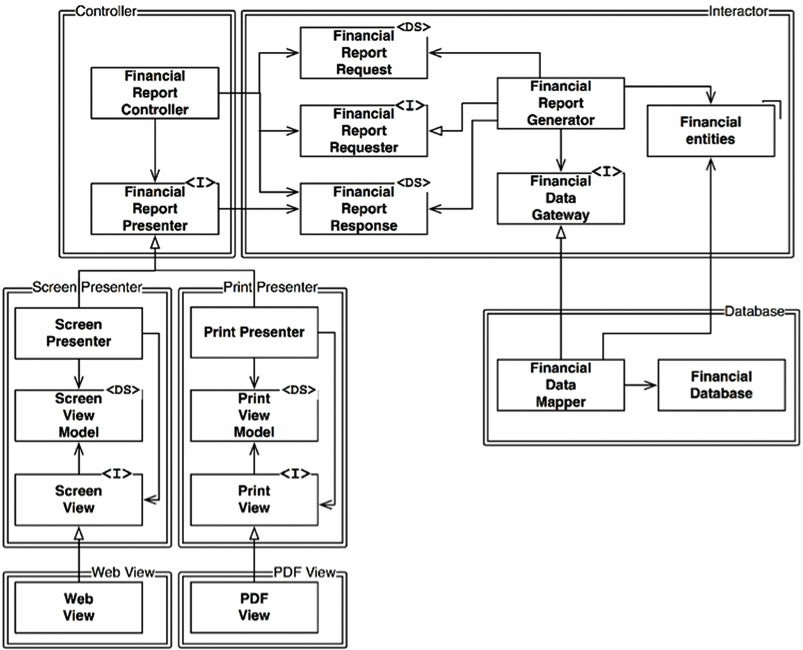
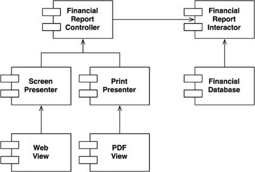

# OCP: THE OPEN-CLOSED PRINCIPLE

`A software artifact should be open for extension but closed for modification.`

Clearly, if simple
extensions to the requirements force massive changes to the software, then the architects of that
software system have engaged in a spectacular failure.

Most students of software design recognize the OCP as a principle that guides them in the design of
classes and modules. But the principle takes on even greater significance when we consider the level
of architectural components.

A thought experiment will make this clear.

## Thought Experiment

Imagine, for a moment, that we have a system that displays a financial summary on a web page. The
data on the page is scrollable, and negative numbers are rendered in red.

Now imagine that the stakeholders ask that this same information be turned into a report to be printed
on a black-and-white printer. The report should be properly paginated, with appropriate page
headers, page footers, and column labels. Negative numbers should be surrounded by parentheses.

Clearly, some new code must be written. But how much old code will have to change?

The answer of this question depends on how the architects developed the software.

A good software architecture would reduce the amount of changed code to the barest minimum.
Ideally, zero.

How? By properly separating the things that change for different reasons (the Single Responsibility
Principle), and then organizing the dependencies between those things properly (the Dependency
Inversion Principle).

If we apply SRP we might come up with the data-flow view shown in the following fig.

Having made this separation, we need to organize the source code dependencies to ensure that
changes to one of those responsibilities do not cause changes in the other. Also, the new organization
should ensure that the behavior can be extended without undo modification

We accomplish this by partitioning the processes into classes, and separating those classes into
components, as shown by the double lines in the diagram in fig 11.

The first thing to notice is that all the dependencies are source code dependencies. An arrow pointing
from class A to class B means that the source code of class A mentions the name of class B, but class
B mentions nothing about class A.

The next thing to notice is that each double line is crossed in one direction only. This means that all
component relationships are unidirectional, as shown in the component graph in Figure 12. These
arrows point toward the components that we want to protect from change.

If component A should be protected from changes in component B, then
component B should depend on component A.

Why should the Interactor hold such a privileged position? Because it contains the business rules.
The Interactor contains the highest-level policies of the application. All the other components are
dealing with peripheral concerns. The Interactor deals with the central concern.

Notice how this creates a hierarchy of protection based on the notion of “level.” Interactors are the
highest-level concept, so they are the most protected.

This is how the OCP works at the architectural level. Architects separate functionality based on how,
why, and when it changes, and then organize that separated functionality into a hierarchy of
components. Higher-level components in that hierarchy are protected from the changes made to
lower-level components.

What an experiment right!

## DIRECTIONAL CONTROL

Much of the complexity in fig 11 was intended to make sure that the dependencies between the components pointed in the
correct direction.

For example, the FinancialDataGateway interface between the FinancialReportGenerator and
the FinancialDataMapper exists to invert the dependency that would otherwise have pointed from
the Interactor component to the Database component. The same is true of the
FinancialReportPresenter interface, and the two View interfaces.

## INFORMATION HIDING

The FinancialReportRequester interface serves a different purpose. It is there to protect the
FinancialReportController from knowing too much about the internals of the Interactor. If that
interface were not there, then the Controller would have transitive dependencies on the
FinancialEntities.

Transitive dependencies are a violation of the general principle that software entities should not
depend on things they don’t directly use.

So, even though our first priority is to protect the Interactor from changes to the Controller, we also
want to protect the Controller from changes to the Interactor by hiding the internals of the Interactor.

## CONCLUSION

The OCP is one of the driving forces behind the architecture of systems. The goal is to make the
system easy to extend without incurring a high impact of change. This goal is accomplished by
partitioning the system into components, and arranging those components into a dependency hierarchy
that protects higher-level components from changes in lower-level components.